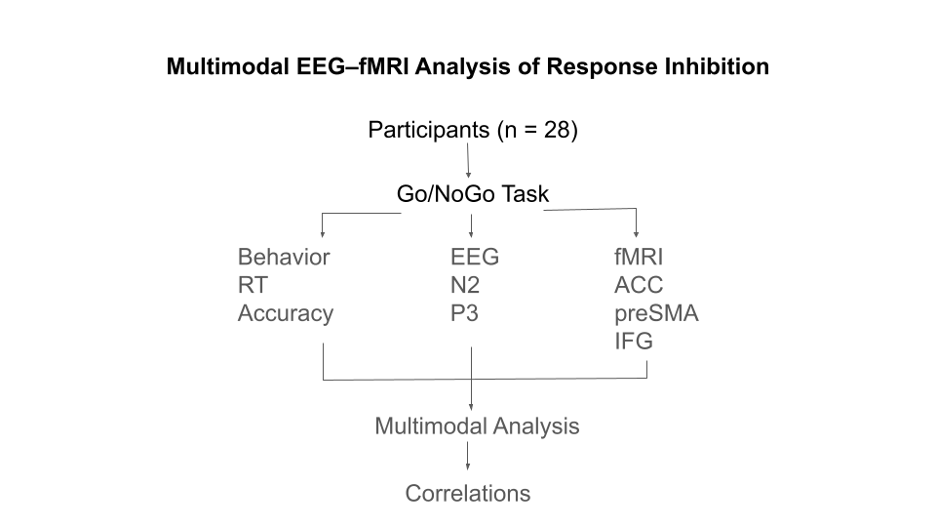
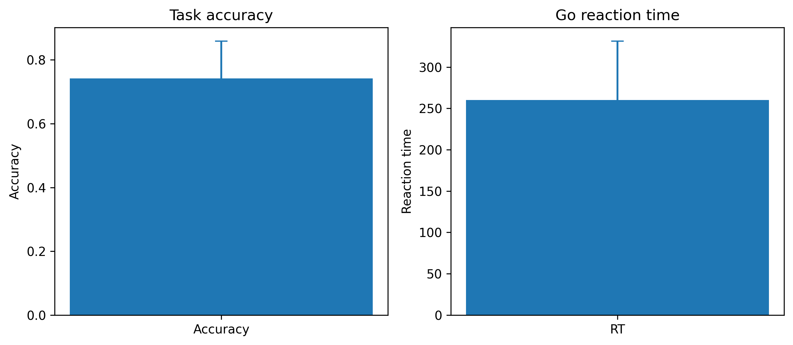
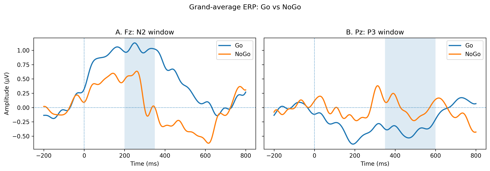
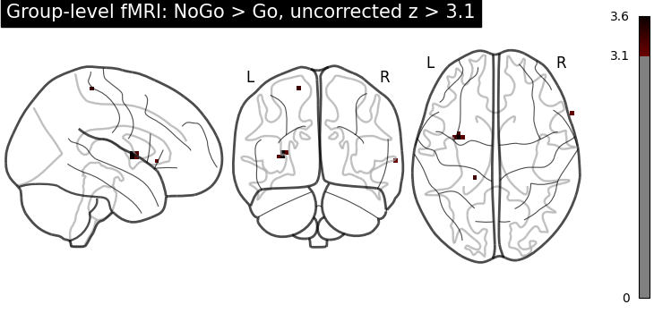
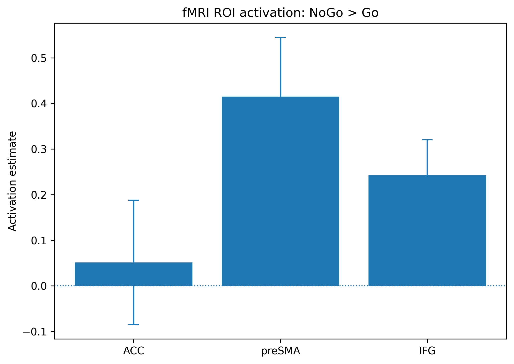

# Multimodal EEG–fMRI Analysis of Response Inhibition




## Overview

This project investigates neural correlates of response inhibition using a publicly available multimodal dataset from OpenNeuro (ds006040).

The analysis combines:

* Behavioral performance
* Event-related potentials (ERPs) derived from EEG
* Functional MRI activation patterns
* Cross-modal EEG–fMRI correlations

The project was developed as an end-to-end reproducible cognitive neuroscience workflow in Python.

## Research Question

How are behavioral measures of inhibitory control related to electrophysiological (EEG) and hemodynamic (fMRI) markers of response inhibition?

Specifically, the project examines:

1. ERP differences between NoGo and Go trials (N2 and P3 components)
2. fMRI activation associated with NoGo versus Go trials
3. ROI activation in key inhibitory-control regions:

   * Anterior Cingulate Cortex (ACC)
   * Pre-Supplementary Motor Area (preSMA)
   * Inferior Frontal Gyrus (IFG)
4. Associations between EEG, fMRI, and behavioral measures

## Dataset

**Source:** [OpenNeuro ds006040](https://openneuro.org/datasets/ds006040)

**Participants:** 28 analyzed participants

**Task:** Sustained attention / Go–NoGo paradigm

**Modalities:**

* Behavioral data
* EEG
* fMRI

## Methods

### Behavioral Analysis

Computed:

* Mean reaction time (RT)
* Accuracy
* Signal detection measures

#### Behavioral Results



### EEG Analysis

**Preprocessing**

* Average reference
* 0.1–30 Hz filtering
* ICA artifact correction
* Epoching around task events

**ERP Components**

| Component | Electrode | Time Window |
| --------- | --------- | ----------- |
| N2        | Fz        | 200–350 ms  |
| P3        | Pz        | 350–600 ms  |

**Contrast:** NoGo − Go

#### ERP Waveforms



### fMRI Analysis

Subject-level NoGo − Go z-statistic maps were entered into a second-level group analysis.

Exploratory ROI analyses were performed using 6-mm spherical ROIs centered on activation peaks observed in:

* ACC
* preSMA
* IFG

Whole-brain maps are shown for visualization at an uncorrected threshold of z > 3.1.

#### Whole-Brain Group Analysis



*Figure 3. Group-level NoGo > Go activation map (uncorrected z > 3.1).*

#### ROI Analysis



*Figure 4. Mean ROI activation estimates for ACC, preSMA, and IFG.*

### Statistics

* Paired t-tests for ERP effects
* One-sample t-tests for ROI activation
* Spearman correlations between EEG, fMRI, and behavioral measures
* Benjamini–Hochberg FDR correction for ROI and correlation analyses

## Key Results

### ERP Findings

* Enhanced NoGo-related N2 component: t(27) = -3.15, p = .004, d = -0.59
* P3 showed a trend-level NoGo–Go difference: t(27) = 2.04, p = .051, d = 0.39

### fMRI Findings

* preSMA: t(27) = 3.21, p = .003, d = 0.61
* IFG: t(27) = 3.13, p = .004, d = 0.59
* ACC: t(27) = 0.38, p = .708

### Multimodal Findings

* Moderate associations were observed between preSMA activation and behavioral performance
* No EEG–fMRI or brain–behavior correlations survived FDR correction

## Conclusion

The results provide convergent EEG and fMRI evidence supporting the role of frontal control networks, particularly preSMA and IFG, in response inhibition. Together, the findings demonstrate the value of multimodal neuroimaging approaches for studying inhibitory control.

## Repository Structure

```text
multimodal-eeg-fmri-inhibition/
│
├── README.md
├── LICENSE
├── requirements.txt
├── multimodal_eeg_fmri_analysis.ipynb
│
├── figures/
│   ├── structure.png
│   ├── Figure1_behavior_accuracy_RT.png
│   ├── Figure2_ERP_Go_NoGo_Fz_Pz.png
│   ├── Figure3_fMRI_whole_brain.png
│   └── Figure4_fMRI_ROI_barplot.png
│
└── outputs/
    ├── eeg_fmri_behavior_merged_nogo-minus-go.csv
    ├── Table1_main_statistical_results.csv
    ├── Table2_ERP_statistics.csv
    ├── Table3_fMRI_ROI_statistics.csv
    └── Table4_all_correlations_FDR.csv
```

## Software

* Python
* NumPy
* Pandas
* SciPy
* MNE-Python
* Nilearn
* NiBabel
* Matplotlib

## Reproducibility

The repository contains analysis code, statistical tables, and figures required to reproduce the reported results.

Raw EEG and fMRI derivatives are not included due to file size limitations. Processed outputs necessary for reproducing the reported findings are provided.

## Limitations

* ROI coordinates were derived from activation peaks observed in the current dataset and should be interpreted as exploratory.
* Whole-brain maps are displayed using an uncorrected visualization threshold.
* Subject-level z-statistic maps were available, whereas subject-level effect-size maps were not.

## Author

**Mariia Kravets**

Psychologist and Cognitive Neuroscience Researcher

Research interests:

* Cognitive Neuroscience
* Learning and Cognitive Plasticity
* Attention and Executive Functions
* EEG and fMRI Methods
* Human Behavior and Data Science
